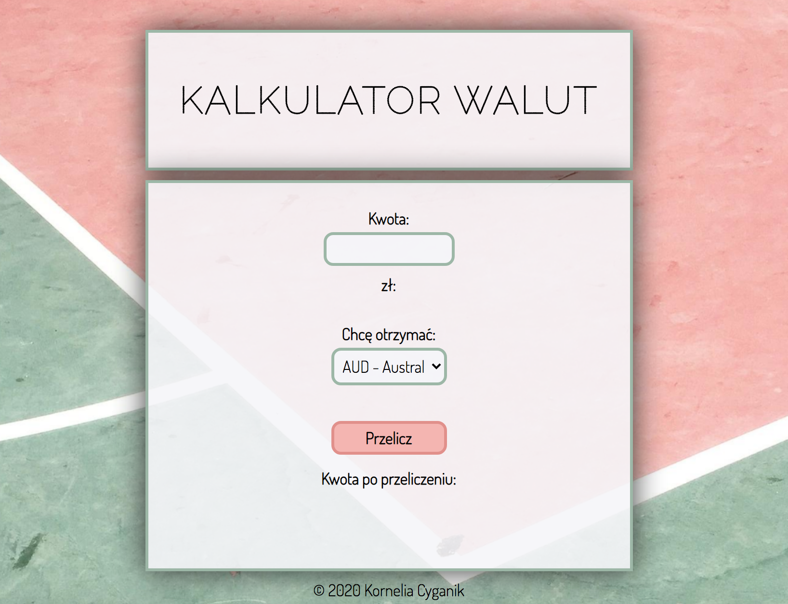

# 
Simple Converter

  

## 
Demo

https://colourofmoonlight.github.io/Simple-Converter-/

## 
Description

This is the project of simple currency converter which takes into account Polish, American, and Australian currency.

## 
Conventions

BEM

